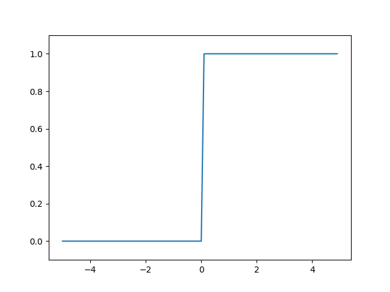
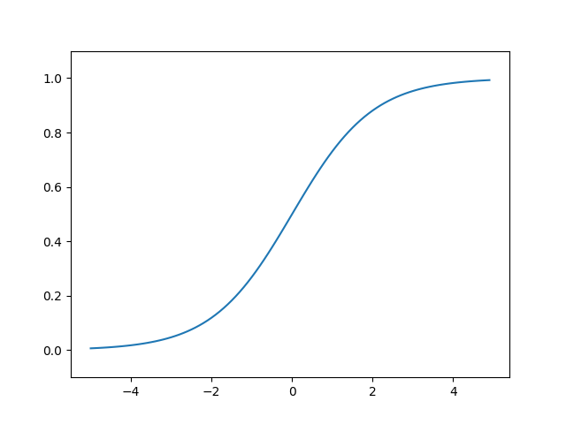
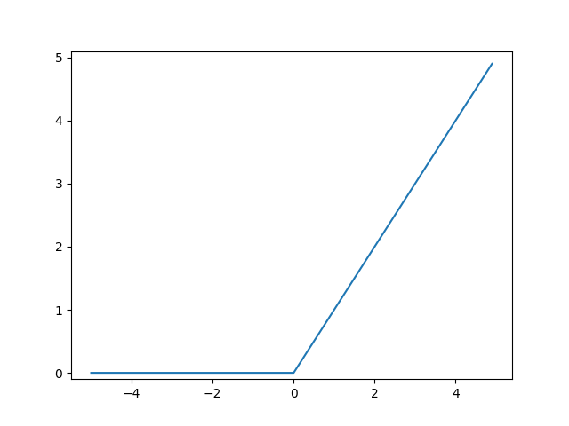

# ニューラルネットワーク

ニューラルネットワークは、適切な重みパラメータをデータから自動で学習できるという重要な性質がある。

## 活性化関数

入力信号の総和を出力信号に変換する関数のことを一般に、活性化関数と呼ぶ。

$$
y = h(b + w_1 x_1 + w_2 x_2)
$$

$$
h(x) =  \left \{
\begin{array}{l}
0 & (x \le 0) \\
1 & (x > 0)
\end{array}
\right.
$$

活性化関数は入力信号の総和がどのように活性化するか（どのように発火するか）ということを決定する役割がある。


## 3.2.1 シグモイド関数

$$h(x) = \frac{1}{ 1 + \exp(-x) }$$

> ニューラルネットワークでは活性化関数にシグモイド関数を用いて信号の変換を行い、その変換された信号が次のニューロンに伝えられます。実は、前章で見たパーセプトロンとこれから見ていくニューラルネットワークの主な違いは、この活性化関数だけなのです。その他の点 - ニューロンが多層につながる構造や、信号の伝達方法 - は基本的に前章のパーセプトロンと同じです。それでは、活性化関数として利用されるシグモイド関数について、ステップ関数と比較しながら詳しく見ていくことにしましょう。

## 3.2.3 ステップ関数



上記のように、ステップ関数は0を境にして出力が0から1（または1から0）へ切り替わります。   
このような形状からステップ関数は階段関数と呼ばれることもあります。


## 3.2.4 シグモイド関数



## 3.2.5 シグモイド関数とステップ関数の比較

シグモイド関数は滑らか曲線であり、入力に対して連続的に出力が変化します。一方、ステップ関数は0を境に急に出力を変えています。このシグモイド関数の滑らかさが、ニューラルネットワークの学習において重要な意味を持ちます。

ニューラルネットワークでは、活性化関数に非線形関数を用いる必要があります。なぜならば、線形関数を用いるとニューラルネットワークで層を深くすることの意味がなくなってしまうからです。
詳しくは、書籍の説明に譲りますが、層を重ねることの恩恵を得るためには活性化関数に非線形関数を使う必要があります。

## 3.2.7 ReLU関数



## 3.3 多次元配列

```python
import numpy as np
A = np.array([[1,2],[3,4]])
print(A)
# [[1 2]
#  [3 4]]

print(A.shape)
# (2, 2)

print(A.ndim)
# 2
```
このように、配列の次元数は np.ndim()で取得でき、配列の形状は np.shape()で取得できます。

要素同士の積ではなく、行列積を行うには np.dot()を使います。

```python
import numpy as np
A = np.array([[1,2],[3,4]])
B = np.array([[5,6],[7,8]])
print(np.dot(A,B))
# [[19 22]
#  [43 50]]
```

機械学習では、numpyを用いて多次元配列を扱うことが多くあり、行列、テンソルのサイズに気をつけて実装をおこな必要があります。  
行列のサイズをコメント等で残しておかないと、Run Timeエラーが発生し、実行が停止してしまいます。

## 3.5 出力層の設計

ニューラルネットワークは、分類問題と回帰問題の両方に用いることができる。   
分類問題と回帰問題のどちらに用いるかで、出力層の活性化関数を変更する必要がある。   
一般的には、以下のように使い分ける

- 回帰問題   
恒等関数

- 分類問題   
ソフトマックス関数

これは以下のように説明できる。   
回帰問題は、ある入力データから（連続的な）数値の予測を行う問題なため、出力関数の前の連続的な値を出力することで問題ない。   
先の例のように、0〜１の値で遷移してきた場合は、出力層の前に、定数倍することで体重なら 50kg〜100kgに収まるようにするなどすることで、恒等関数によりそのまま値を出力することで適切な値を得ることができる。
